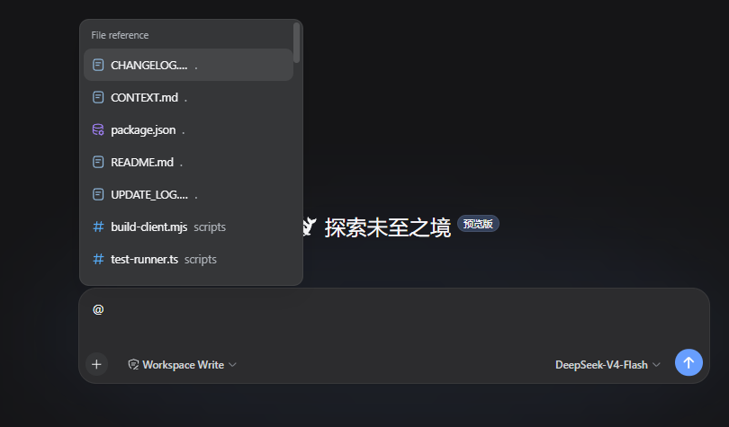
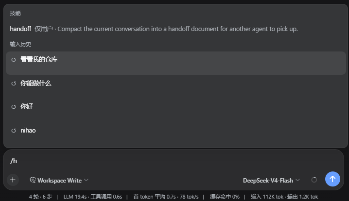

# dsh-input-plus

[English README](README.md)

DSH Web UI 的输入框增强插件。它在 Host 侧建立当前工作区的文件索引，在浏览器侧接入 DSH 官方的 `@` 输入触发器，让你可以在组合框中搜索并插入文件或目录路径。输入 `/h` 可以打开当前 Session 的历史问题候选菜单，方便复用以前的提问。






## 当前功能

### `@` 文件和目录路径选择

在 DSH 组合框中输入 `@`，继续输入文件名、目录名或路径片段，候选菜单会列出当前 Session 工作区内的文件和目录。选中后，输入框中保留普通文本引用，例如：

```text
@src/contract.ts
```

引用只保留路径，不会在发送时读取文件正文、展开目录或生成目录清单。模型需要查看目标时，使用当前 Session 原生提供的工作区工具按需读取。

选中目录后可以继续输入操作：

```text
@src 查找负责候选排序的代码
```

官方输入触发器负责候选菜单、光标和写回行为；本插件不会替换官方 textarea、发送按钮或候选菜单，也不会接管原生方向键行为。

### `/h` 输入历史

在组合框中输入 `/h`，会通过 DSH 官方的 `/` 输入触发器打开历史候选菜单。可以继续输入关键词筛选，例如：

```text
/h
```

候选项只显示当前 Session 中已经成功提交过的用户问题，按最近使用顺序排列。

## 安装

需要 DSH `0.1.0-rc.6` 或兼容的 DSH Web profile。通过 DSH 官方 profile 插件流程安装：

```bash
dsh plugin --profile web add https://github.com/WhitePlusMS/dsh-input-plus/archive/refs/tags/v0.0.1.tar.gz
```

## 配置

插件注册的设置命名空间为 `input-plus`。当前实际参与工作区索引和路径解析的配置如下：

| 配置项 | 默认值 | 范围 | 说明 |
|---|---:|---:|---|
| `maxIndexDepth` | `3` | `0–10` | 工作区索引的最大目录深度 |
| `maxIndexEntries` | `200` | `1–2000` | 每次候选索引最多保留的条目数 |
| `referenceRoot` | `''` | 绝对路径或空字符串 | 覆盖当前 Session 工作区；为空时使用 Session workspace |


## 开发

环境要求：Node.js 18+、pnpm。

```bash
pnpm install

# TypeScript 类型检查
pnpm run typecheck

# 运行进程内测试
pnpm test

# 构建 Host 和浏览器 bundle
pnpm run build

# 检查 lib/client.js 是否与源码同步
pnpm run check:client
```

构建包括两部分：

- `tsc -p tsconfig.build.json` 生成 Host 代码和声明文件；
- `scripts/build-client.mjs` 使用 TypeScript Compiler API 在进程内生成
  `lib/client.js`，避免 esbuild 原生服务进程在受限环境中启动失败。

## 目录结构

```text
src/
  index.ts            Host 插件入口、设置和 HTTP 路由
  contract.ts         Host/Client 共享的最小通信契约
  host/
    files.ts          工作区索引、匹配和路径安全
    git.ts            Git 修改状态读取
    settings.ts       设置 schema 和默认值
    workspace.ts      Session 工作区解析
  client/
    index.ts          浏览器插件入口
    input-source.ts   @ 候选源和路径写回
    history-source.ts /h、/history 候选源和两行菜单样式
    history-recorder.ts 当前 Session 提交记录
    find.ts           Client 候选匹配和排序
    file-icons.ts     候选图标
    input-status.ts   composer status dock
scripts/
  build-client.mjs    浏览器 bundle 构建器
  test-runner.ts      进程内测试入口
```

## 许可证

MIT
